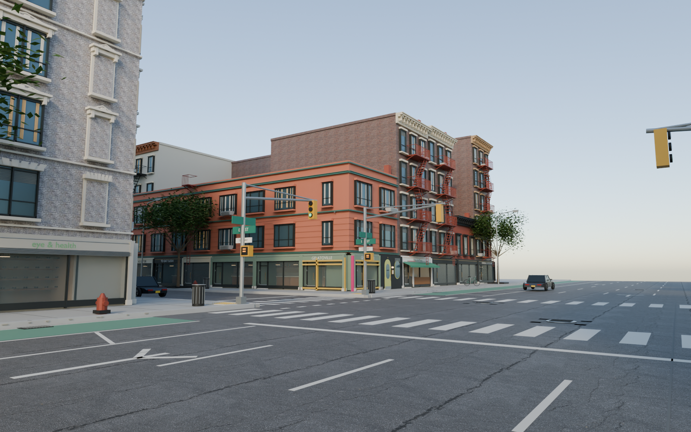
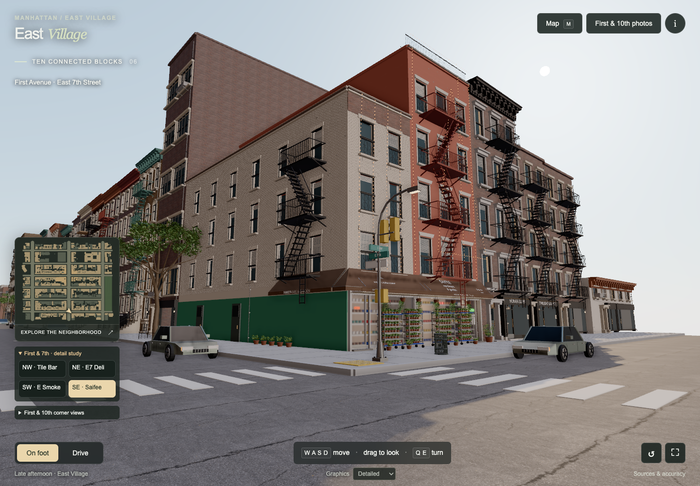
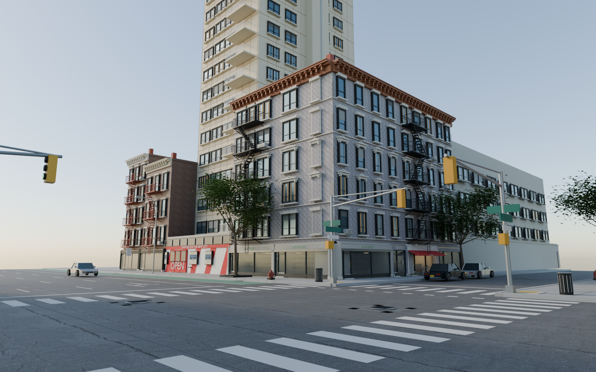

<div align="center">

# Borough Drive

**A little piece of New York, at your own pace.**

Walk and drive through ten connected East Village blocks, reconstructed from mapped footprints and photographic observations.

[](https://github.com/rayidali/borough-drive/actions/workflows/verify.yml)
[](LICENSE)
[](package.json)
[](dist/vendor/THREE-LICENSE.txt)

[Play online](https://borough-drive.vercel.app) · [Get started](#get-started) · [Explore the project](#how-it-works) · [Contribute](CONTRIBUTING.md) · [Sources & credits](dist/reconstruction/ASSET-CREDITS.md)

</div>



*First & 10th, the project's most individually detailed intersection. This is a Blender render of the authored model; browser lighting differs. [Image and model credits](dist/reconstruction/ASSET-CREDITS.md).*

## The neighborhood

Borough Drive is a small, explorable reconstruction of Manhattan's East Village. The focus is familiar streets, recognizable architecture, warm afternoon light, and a relaxed driving feel. The long-term ambition is to explore more of New York; the current work concentrates on making these ten blocks better.

The playable area runs from **East 7th to East 12th Street**, between **Second Avenue and Avenue A**. You start at **First Avenue and East 7th Street, facing north**. First & 10th remains the preserved detail anchor, with ten complete blocks and four boundary sections extending toward the edge of Tompkins Square Park.

- **Walk or drive.** Explore on foot or take the wheel, with braking, reverse, steering, and building collision.
- **Find your way.** A minimap follows your position; search the travel map for a place or building address.
- **Look closer.** Storefront openings, shallow shop interiors, cornices, fire escapes, signs, and sidewalk details give the core its character.
- **Recognize local landmarks.** Distinct forms include Ottendorfer Library, Village East Cinema, the Orpheum, and neighborhood churches.
- **Run it locally.** All runtime libraries, models, textures, and map data are included. The game needs no backend, API key, or live map service.

The accepted [First & 7th study, revision 06](model-source/FIRST-SEVENTH-PASS-06.md), concentrates on **five buildings, nine exposed elevations and eight shops across the four corners**. It adds individual window/lintel layouts, Saifee's two different building heights, Tile Bar's tiled entrance and seating, shop signs, doors, display inventory and street hardware. The rest of the map keeps its existing designs.

The [Street View refinement, pass 08](model-source/FIRST-SEVENTH-PASS-08.md), updates the same corner with April 2026 references: current Monkey/Hen signs, Saifee’s side shop displays and small windows, Tile Bar’s longer canopy, revised fire escapes, wall markings and street hardware. Passes 08 and 09 were published on September 10; the [handoff](CODEX-HANDOFF.md) records the verified source and deployment.

The [browser pass 09](model-source/BROWSER-PASS-09.md) adds static clouds, bounded road surface variation, smoother driving presentation and lower-cost contact shading. **Automatic** adapts pixel work during slow frames and restores a sharper stopped view; saved graphics choices remain. The project stays browser-first. A [bounded offline block workflow](model-source/BLOCK-WORKFLOW.md) prepares small tasks for cheaper AI workers; no paid batch or wider map update has run.



*Revision 06, captured in the actual browser game with Detailed graphics. [Northwest](docs/images/first-seventh-nw-revision-06.png), [northeast](docs/images/first-seventh-ne-revision-06.png), [southwest](docs/images/first-seventh-sw-revision-06.png), [Tile Bar](docs/images/tile-bar-revision-06.png) and [Saifee](docs/images/saifee-revision-06.png). These are game captures, not street photographs. The owner accepted this as the minimum completion standard on September 9, 2026. [Performance pass 07](model-source/PERFORMANCE-PASS-07.md) retains these models and improves loading/rendering; the [handoff](CODEX-HANDOFF.md) records publication status. [Credits](dist/reconstruction/ASSET-CREDITS.md).*

## Get started

[Play Borough Drive in your browser](https://borough-drive.vercel.app), or run it locally with **Node.js 22 or newer**:

```sh
git clone https://github.com/rayidali/borough-drive.git
cd borough-drive
npm run dev
```

Open **http://127.0.0.1:5173** in a browser with WebGL2 and hardware acceleration. Keep the terminal running while you play.

There is no `npm install` step. Blender is only needed when regenerating models. Startup prioritizes First & 7th. The preserved 24.4 MiB First & 10th model loads as you approach; its exact street materials are available in a smaller startup asset.

If port 5173 is occupied, run `npm run dev -- 5174`. See [START-HERE.md](START-HERE.md) for the Python alternative and troubleshooting.

### Controls

| Action | Controls |
| --- | --- |
| Walk | W / A / S / D |
| Look around | Drag with the pointer |
| Turn on foot | Q / E |
| Switch modes | **On foot** / **Drive** buttons |
| Accelerate / brake, then reverse | W / S while driving |
| Steer | A / D while driving |
| Brake | Space |
| Open the travel map | M |
| Return to First & 7th | R |
| Inspect its four corners | First & 7th detail-study buttons |
| Choose rendering quality | Graphics selector; Detailed is the default |



*The southwest corner and theater frontage, rendered from the exported model in Blender. These previews show the detailed core. [Sources and photographic provenance](dist/reconstruction/references.json).*

## How it works

The browser runs vanilla JavaScript modules and bundled **Three.js r180**. Blender recipes generate Draco-compressed GLB models. Fourteen neighborhood sections load detailed geometry as you approach, with simpler distant silhouettes and shared textures. Repeated street props use GPU instancing, and driving runs on a fixed simulation step. Spatial batches retain all authored triangles while improving culling. Shared surface images download/decode once, thin storefront glass keeps reflections without an extra city render, and a settled view stops redrawing. Detailed remains the default, with ambient shading and four-sample edge smoothing. See [the measured performance report](model-source/PERFORMANCE-PASS-07.md).

| Location | Purpose |
| --- | --- |
| [`dist/index.html`](dist/index.html) | Active game entry point |
| [`dist/reconstruction/viewer.js`](dist/reconstruction/viewer.js) | Rendering, camera, input, and interface |
| [`dist/reconstruction/vehicle.js`](dist/reconstruction/vehicle.js) | Vehicle simulation |
| [`dist/reconstruction/neighborhood-world.js`](dist/reconstruction/neighborhood-world.js) | Streets, collision, and travel destinations |
| [`dist/reconstruction/neighborhood-render.js`](dist/reconstruction/neighborhood-render.js) | Section streaming and street props |
| [`dist/reconstruction/neighborhood-map.js`](dist/reconstruction/neighborhood-map.js) | Minimap and travel map |
| [`model-source/`](model-source/) | Reproducible Blender recipes, facade observations, and research |
| [`source-data/`](source-data/) | OSM snapshot, municipal extracts and dated business evidence |
| [`scripts/`](scripts/) | Local server, data preparation, and verification |
| [`dist/vendor/`](dist/vendor/) | Bundled renderer and Draco decoder with license notices |

**`dist/` is editable source and required game content.** Keep it in Git. The older generic experiment lives at [`dist/prototype.html`](dist/prototype.html); the active game is `dist/index.html`.

### Verify changes

```sh
npm run verify
```

The checks cover local module paths, interface references, GLBs, textures, 2,308 road samples, map destinations, boundary driving, braking, reverse, collision, and frame-rate independence of the vehicle simulation. They also check lossless spatial partitioning and exact reproduction of the street-material startup asset, municipal building joins, restored identities, courtyard openings, business partitions, the First & 7th start, storefront source/model signatures and sidewalk furniture collision. GitHub Actions runs the same checks on Node.js 22 and 24.

These are code and asset checks. Visual accuracy, driving feel, and browser frame rate need separate hands-on review.

### Rebuild models

Existing models are ready to use. If you change geometry, use **Blender 4.3 or newer** and rebuild only the affected section where possible:

```sh
blender -b -t 6 --python-exit-code 1 --python model-source/build_neighborhood.py -- --tile block-3-2
```

The [neighborhood notes](model-source/NEIGHBORHOOD-NOTES.md#rebuild-order) explain the full rebuild order. Geometry preparation resets derived facade and prop data, so the detail compiler must run afterward.

## Accuracy and sources

This is a reconstruction prototype with uneven detail. The map contains **615 building objects**, including annexes and boundary context. **411 additional building records have photographic observations**, ranging from individual storefront details to fuller elevations. This does not verify every elevation or every modeled detail.

OpenStreetMap's **September 5, 2026** snapshot is supplemented by NYC OTI building footprints and roof heights and DCP's **PLUTO 26v2** parcel records. All 620 municipal footprint records in the extracted area have an explicit match; five missing buildings were restored. Business baseline checks are dated **September 6, 2026**; September 8 identity corrections leave **214 supported named places, including 204 outside the core**. Architectural photographs include older archive views with unknown capture dates. There are now 27 individual non-core shop designs; 177 supported names still use estimated designs. Pass 08 uses inspected April 2026 Street View panoramas at First & 7th, with September 2024 closer west/Yubu views. Revision 06 predates successful API access. Exact artwork, dimensions and partly obscured shops remain unresolved. Secondary facades, road widths, trees, street furniture, shop partitions and interiors include estimates. Some preserved signs are explicitly historical.

Observations, occupancy claims, and inferred geometry are recorded separately. Unknown occupants stay unnamed, and photographic references keep their dates, authors, and reuse terms.

- [Neighborhood scope, landmarks, and known gaps](model-source/NEIGHBORHOOD-NOTES.md)
- [First & 7th pass 08](model-source/FIRST-SEVENTH-PASS-08.md), [dated Street View observations](model-source/first-seventh-street-view-08.json), [accepted revision 06](model-source/FIRST-SEVENTH-PASS-06.md), [individual corner records](model-source/first-and-seventh.json)
- [Historical storefront pass 05](model-source/STOREFRONT-PASS-05.md), [individual designs and photo sources](model-source/storefront-details.json), and [all 641 non-core street frontages](model-source/digital-twin-coverage.json)
- [Accuracy audit, corrections and evidence limits](model-source/ACCURACY-PASS-04.md)
- [Core facade observations](model-source/FACADE-NOTES.md) and [storefront references](model-source/CURRENT-STOREFRONTS.md)
- [Editable neighborhood observation schedule](model-source/neighborhood-observations.json)
- [Map-wide facade audit](model-source/neighborhood-facade-audit.json) and [business inventory](model-source/neighborhood-business-audit.json)
- [Detailed architectural research](model-source/neighborhood-references/)
- [Photographic provenance](dist/reconstruction/references.json) and [complete asset credits](dist/reconstruction/ASSET-CREDITS.md)
- [Core detail-pass notes](docs/DETAIL-PASS-02.md)

## Resume development

Read [AGENTS.md](AGENTS.md), the current [handoff](CODEX-HANDOFF.md), the latest [session log](SESSION-LOG.md), and [START-HERE.md](START-HERE.md) before continuing an existing session. First & 7th revision 06 is the accepted minimum standard; [performance pass 07](model-source/PERFORMANCE-PASS-07.md) records the current speed changes and review evidence. The handoff distinguishes local commits, pushing to main and a verified live deployment. The next discussion is an economical block/street process; wider implementation is deferred.

The user resumed work specifically at First & 7th. Revision 06 remains the accepted minimum; pass 08 is the published corner comparison pass, with browser presentation improved in pass 09. Review this intersection before extending block by block. The whole-map digital-twin objective remains unfinished. Recording an evidence gap or adding a business name does not resolve the corresponding visual work. Resume with the user's next instruction, preserving the First & 10th standard throughout the requested scope.

## Contributing

Contributions are welcome, especially focused improvements to building fidelity, controls, accessibility, and measured browser performance. See [CONTRIBUTING.md](CONTRIBUTING.md) for setup, evidence requirements, and how to submit a change.

Possible work after the next scope decision:

- Work through the frontage inventory with dated references and individually modeled details; report each contribution's actual coverage and remaining gaps.
- Measure driving feel and browser performance on real devices.
- Refine lighting and materials while preserving neighborhood geometry and the accepted First & 10th core.

Please discuss broad geographic expansions or structural migrations in an issue before starting them.

## License and acknowledgments

Original code, documentation, and independently authored artistic contributions are available under the **[MIT License](LICENSE)**. Bundled third-party code, photographs, textures, and geographic data retain their own terms. Models and renders can combine these components; the MIT license does not replace their attribution or data-license requirements.

Geography is © [OpenStreetMap contributors](https://www.openstreetmap.org/copyright), under ODbL 1.0. Photographic credits include Eden, Janine and Jim (CC BY 2.0) and Kidfly182 (CC BY-SA 4.0). Surface materials and reflection lighting come from [Poly Haven](https://polyhaven.com/license), under CC0. Three.js is MIT-licensed; Draco uses Apache 2.0.

See [THIRD-PARTY-NOTICES.md](THIRD-PARTY-NOTICES.md) for the license boundaries and [ASSET-CREDITS.md](dist/reconstruction/ASSET-CREDITS.md) for detailed attribution.
