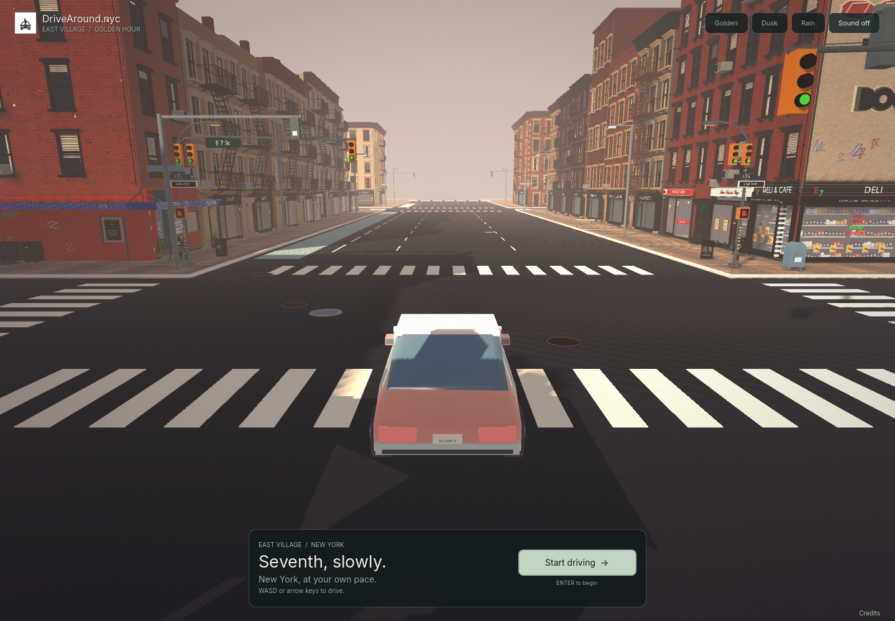

# DriveAround.nyc interface pass — September 21, 2026

**September 23 context:** this dated interface report remains valid for the preserved UI. The subsequently published [revision 07](SEVENTH-ENGINE-07.md) changes east-block architecture, so “revision 04 architecture” below describes the interface pass at its original date. Read the [closing handoff](../CODEX-HANDOFF.md) for the current package/deployment; audio and the UI remain unchanged.

The user rejected the large left intro, fonts and overall layout, asking for professional product polish with an indie-game lo-fi mood. This presentation pass replaces the oversized card with a compact bottom launch panel and leaves the neighborhood as the main view. Architecture remains Seventh revision 04.

**Published closing state:** interface source/runtime `b194dc6ca371b588b27f073bd6cf5be9df4fa9ca`; publication checkpoint `533570ed9ee458e7f5104c23e35d6b19447d7122` also passed [both CI jobs](https://github.com/rayidali/borough-drive/actions/runs/35671744723) and [Vercel deployment](https://vercel.com/rayidalis-projects/borough-drive/4ssCMoWSCSJaTwnvZa2DCoQ6TkuA). The final branded `/` and `/index.html` matched the Seventh and legacy shells. [Play](https://www.drivearound.nyc/) · [Resume checkpoint](../CODEX-HANDOFF.md). Closing documentation changes no runtime bytes; no further UI/audio/street job is queued.



[Previous intro](../docs/images/interface-05/before-intro.png) · [New loading screen](../docs/images/interface-05/loading-desktop.png) · [Driving](../docs/images/interface-05/driving-desktop.png) · [800×600 start](../docs/images/interface-05/intro-small.png) · [800×600 controls](../docs/images/interface-05/help-small.png)

These are captures of the local browser game. The user's two private screenshots are not included.

## Presentation contract

| Element | Implemented treatment |
| --- | --- |
| Identity | Supplied car/Liberty PNG, unchanged, beside `DriveAround.nyc`; the same source is the Seventh tab/touch icon. No generated logo or replacement mark. |
| Type | Locally bundled Inter 4.1: TTF for Godot, WOFF2 for HTML. Regular and medium weights, compact labels, restrained single-line chapter title. [Source hashes and OFL](../engine/first-seventh/assets/fonts/SOURCES.md). |
| Palette | Charcoal `#182426`, warm white `#f4f2eb`, sage `#aec4b5`. Muted text is `#a8b3ad` in the HUD and `#b7c1bd` in the shell. Warm `#e7c9a9` remains a small drivetrain status accent. |
| Surfaces | Translucent charcoal panels, faint sage borders, 7–10 px corner radii, 24 px outer HUD spacing (16 px in narrow windows). No new world postprocessing or decorative animation. |
| Start | Bottom-centered launch panel up to 640 px wide, 27 px chapter title, short description and one primary action. Below 680 px it stacks within the viewport. Start/Enter begins. The unavailable Pause action is hidden until play starts. |
| Playing | Small identity/weather/sound/pause rail; compact map/speed/address panel; Camera and Postcard with a single controls hint. Existing keyboard shortcuts remain. |
| Pause/help | Small centered pause panel. Resume, return, fullscreen and Controls are focusable with Tab. Controls expands the gesture/key guide; primary text remains dark on sage when focused. |
| Loading/error | Quiet dark shell, modest headline, thin progress and visible Retry. Progress hides during failures. Local credits remain reachable. Added CSS transitions respect reduced-motion preferences. |

The HUD uses actual viewport pixels instead of scaling the whole interface from a fixed 1280×800 canvas. This keeps text readable in the tested 800×600 window. Below 680 px, the identity/actions and lower rail stack, weather actions can wrap, and the map drawing yields room while speed/address/actions remain. The engine's existing Retina pixel cap and adaptive 3D scale remain separate. Desktop keyboard/mouse play is the target; narrow presentation is not touch-driving support or a full accessibility claim.

## Reproduction and package

Implementation is in [hud.gd](../engine/first-seventh/scripts/hud.gd), [minimap.gd](../engine/first-seventh/scripts/minimap.gd), [project.godot](../engine/first-seventh/project.godot) and [shell.html](../engine/first-seventh/web/shell.html). The [exporter](../scripts/export-seventh.mjs) copies the font, license and logo into the served package and hashes the new source formats. The local server sends font MIME types; the verifier requires all three new web files.

```sh
npm run seventh:build
npm run seventh:verify
npm run verify
npm run dev
```

Open `http://127.0.0.1:5173/`; `/seventh/` serves the same build and `/index.html` preserves the legacy game. Keep `dist/index.html` absent. No Blender export is needed for this interface change.

The [tested interface record](interface-review-2026-09-21/interface-review.json) embeds the exact package and all source hashes; [build.json](../dist/seventh/build.json) is the current export manifest. Its inherited `sourceCommit` is the geographic baseline, not the checkout revision. The starting checkout was `d7546478a101d10e15c8a6f1ef46ed6c850dc052`; the implementation, runtime and review evidence are saved in `b194dc6ca371b588b27f073bd6cf5be9df4fa9ca` and pushed to `main` at the user’s subsequent request.

The PCK grew from 86,494,928 to 87,390,432 bytes, principally for the bundled font/logo. The complete 14-file runtime is 127,760,150 bytes uncompressed. No new external runtime font/image service is used. Both original font license sets and existing engine/material credits remain included.

## Review evidence

- `npm run seventh:build` completed; `npm run seventh:verify` passed 14 package files, 82 source hashes, 182 buildings and all 82 Seventh frontages. `npm run verify` passed the original model/module/road/vehicle/presentation checks. An initial restricted build logged denied local settings/log writes; the final build completed cleanly with normal local Godot access.
- [Interface captures](interface-review-2026-09-21/captures.json) cover loading, intro, driving, pause and expanded help at desktop/laptop sizes, plus 390×844 and 640×600 narrow layouts and intro at 1100×800/DPR 2. Actual Tab navigation opened Controls; Escape resumed. Focus contrast and narrow layout were corrected after initial review.
- [Full browser review](interface-review-2026-09-21/browser.json) passed 12 weather/camera combinations, real-key driving/brake/reverse/drift/reset/pause, saved settings, tab-loss pause, Retina cap, postcard download and both missing-pack/WebGL-loss retries, with zero healthy-runtime errors/warnings/failed requests. [Download recovery](../docs/images/interface-05/download-recovery.png) and [graphics recovery](../docs/images/interface-05/graphics-recovery.png) were visually inspected. This full run preceded the last narrow-layout adjustment; its embedded hashes identify that intermediate package. Final-layout capture and focused camera/address records identify the final build separately.
- [Local route/asset checks](interface-review-2026-09-21/local-routes.json) matched the root/direct/legacy HTML, logo, font, license and credits to disk, with successful responses and expected MIME types.
- Final [camera checks](interface-review-2026-09-21/camera.json) passed all four viewpoints, orbit/pan/zoom/recenter, stable car transform, drag release over HUD and pause/resume. Final [address checks](interface-review-2026-09-21/address.json) passed all nine mapped-address/hide cases. A camera input transport timeout and a hidden address-tab startup timeout required fresh/foregrounded repeats; both final runs passed. The focused review runners now explicitly foreground the tab, and camera review waits for the loading overlay to hide. [Exact validation boundaries and retry notes](interface-review-2026-09-21/validation.json).
- [Preservation check](interface-review-2026-09-21/preservation.json) matched all 182 GLB hashes and verified unchanged geographic data, model recipes, controller/camera/audio sources, legacy assets and routing. Both private screenshots remain local and untracked.

## Limits and next review

This is a presentation pass; the existing architectural acceptance state remains unchanged. Publication and live verification are recorded in the [current handoff](../CODEX-HANDOFF.md). No calibrated photographic acceptance, listening review, new track or music-level change occurred. The original full PNG is now used as the icon; specially prepared 16/32/48 px artwork, social previews and legacy-game branding remain separate work in the [experience brief](../docs/DRIVEAROUND-EXPERIENCE-BRIEF.md).

Visual review covers the listed sizes, not a mobile/browser matrix, screen-reader navigation or 200% browser zoom. The intermediate full review measured 8.23 s local startup and 39.1–53.8 FPS in its driving samples, with adaptive scale reaching 0.75; these are observations from this run, not a controlled comparison against the prior UI or a speed improvement claim. Further aesthetic changes and the remaining music/icon work follow the user’s next instruction. See the [current handoff](../CODEX-HANDOFF.md) for exact save/push/deployment state.
