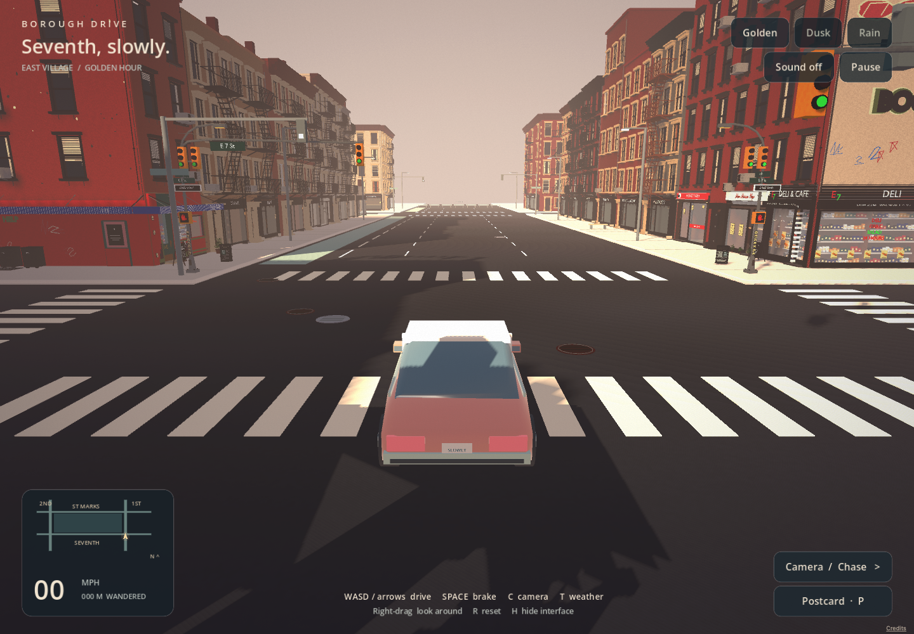

# Seventh, slowly. — browser engine study 01

September 14, 2026. The user asked for a faster, aesthetic lofi browser driving game with several viewpoints and weather, beginning around First & Seventh. After discussing Unreal Pixel Streaming, they deferred obtaining a GPU machine and authorized proceeding with available tools. The delivered local slice uses **Godot 4.7.2 Compatibility / WebGL 2**, with the game running on each player's device.

Start `npm run dev` and open **http://127.0.0.1:5173/seventh/**. [Controls and reproducible build](../engine/first-seventh/README.md). The existing ten-block Three.js game remains at `/`. This work is local on `feature/seventh-lofi-engine`; [the current checkpoint](../CODEX-HANDOFF.md) records the exact saved source and separate push/deployment states. No paid compute, wider imagery jobs or publication occurred.

## What changed

- Original apricot/cream coupe with animated wheels, steering, body motion, braking, reverse, building/road-end collision and reset.
- Chase, hood, cockpit and overhead cameras, smooth following, right-drag orbit and camera obstruction checks.
- Golden hour, blue hour and passing rain, animated procedural clouds/rain, authored warm/cool colors, wet asphalt and dusk lighting.
- Complete First–Second–Seventh–St Marks driving circuit, recognizable existing storefront geometry, sidewalks/crossings and authored street furniture.
- Small route map, speed/distance display, pause/focus-loss handling, three original synthesized audio loops, saved camera/weather/sound preferences and downloadable game-view postcards.
- Self-contained browser package, loading progress, visible Retry for download/graphics failures, CSS-pixel rendering on Retina and adaptive 3D scale under slow driving frames.

The project uses individual building meshes with imported distance detail and frustum culling, shared facade materials and combined small street-prop geometry. Sky/road presentation avoids a second full-scene post-processing render. No game computation is sent to a server. The user can keep Vercel for static distribution; the existing hosting configuration already serves `dist/`. [Godot's web export documentation](https://docs.godotengine.org/en/stable/tutorials/export/exporting_for_web.html), [Vercel CDN operation](https://vercel.com/docs/how-vercel-cdn-works).

[Rain capture](../docs/images/seventh-engine-01/rain-chase.png) · [Cockpit](../docs/images/seventh-engine-01/cockpit.png) · [Overhead](../docs/images/seventh-engine-01/dusk-overhead.png). These are game captures, not reference photographs.

## Sources and preservation

The original geographic/gameplay baseline is `c76dccebc143960498d21eeab8c55c2d0dbcc5ce`. [Exporter](export_seventh_engine.py) reads its existing recipes without running the compiler or modifying original models. The separate slice includes 154 existing objects and 2,835,181 source triangles; this object count includes annexes and does not represent 154 newly verified facades. All five corner objects are included. [Asset preparation evidence](engine-review-2026-09-14/asset-preparation.json) and [slice manifest](../engine/first-seventh/assets/slice.json) record identities, source hashes and GLB hashes.

Lofi vertex colors are a separate presentation of the same geometry; they replace the original texture treatment in this experiment. The car, added props, weather, lights and music are authored atmosphere. They are not new photographs, measured architectural observations or user acceptance. First & Seventh revision 06 remains the user's accepted minimum, and the protected First & Tenth core stays in the original game. Original runtime assets, source data, reference records and credits are preserved.

The complete Godot/third-party notices, original-code MIT, Damion OFL and geographic attribution ship with the browser package. [Credits](../dist/seventh/credits.txt), [inherited licenses and photographic provenance](../THIRD-PARTY-NOTICES.md). No GTA assets, branding or recordings were used.

## Measured review

Final browser evidence is [browser-final.json](engine-review-2026-09-14/browser-final.json); [native circuit evidence](engine-review-2026-09-14/native-final.json) is separate. Captures are actual game views. Engine source and package hashes are in [build.json](../dist/seventh/build.json); `npm run seventh:verify` detects source/export drift.

Conditions: Apple M1 MacBook Air, 8 GB RAM, Brave/Chromium 153, 1440×1000 CSS pixels / DPR 1; local HTTP, no CPU/network throttling, browser cache disabled for initial loading, subsequent driving samples warmed. The isolated browser used only its own profile, port 9222 and first-run suppression flags; no frame-rate or GPU override flags. Rendered FPS uses differences between engine frame counters and their timestamps; RAF timing is recorded independently.

| Short northbound driving sample | Rendered FPS | Mean draw calls | Mean submitted triangles | 3D scale |
| --- | ---: | ---: | ---: | ---: |
| Golden hour | 74.8 | 485 | 2.87 million | 1.0 |
| Blue hour | 75.0 | 485 | 2.86 million | 1.0 |
| Passing rain | 75.0 | 486 | 2.86 million | 1.0 |

These are roughly five-second samples, not a universal 75-FPS promise. Final local startup was **3.62 seconds**, with browser/driver compilation caches warmed by earlier reviews; the first playable run was 9.26 seconds. Healthy final gameplay recorded zero console errors, warnings or failed requests. The four deliberately injected HTTP 503 responses and the forced graphics-loss error are recorded only in the separate recovery section.

The original game's fresh [baseline](engine-review-2026-09-14/browser-baseline.json) was 22.29 FPS in Detailed driving and 42.18 FPS in an additional warm Automatic driving sample, reaching .70 resolution/AO off. The scenes, rendering features and map extent differ: this does not establish an equal-scene engine speedup or a ten-block result. The [first playable browser review](engine-review-2026-09-14/browser-first-playable.json) is retained as preliminary evidence and is superseded by the final timestamped counters.

Native testing drove the full nine-waypoint circuit in 65.986 seconds with zero wall contacts, using the same vehicle controller/collisions. A separate sweep against a real frontage, reverse and reset passed. Browser testing covers all twelve camera/weather views, actual keyboard controls, reverse/braking/steering/reset, pause, preference reload, Retina sizing, tab switching, postcard download and deliberate missing-pack/context-loss Retry. Expected errors from fault injection are recorded separately from healthy gameplay. `npm run verify` passes for the preserved original game; those static tests alone do not establish appearance or frame rate.

## Limits and next work

This is a single-player art/gameplay prototype. Shared-world multiplayer, traffic, missions, mobile touch controls and a broad device/browser performance matrix are not implemented. Five hundred simultaneous independent visitors remains a distribution/bandwidth and device-testing goal; no load test or capacity guarantee is claimed. There is no rented GPU or per-player server process.

The raw package is about **102 MiB**: approximately 64 MiB scene pack and 38 MiB engine WASM, plus small scripts/notices. A local Brotli level-6 estimate puts the two large assets together around 64.8 MiB; this is not a verified Vercel transfer measurement. The scene pack already contains compressed meshes. First-load weight is a remaining optimization, despite improved driving smoothness; local startup timing does not represent a slow public connection. Asset streaming/pack reduction and a smaller engine export are worthwhile next optimizations before promotion.

Visuals are stylized, with simplified surface response, small authored interiors, approximate extra props and no physically traced reflections. Existing hidden/unmeasured facade details stay uncertain. The user should review the actual local art direction and handling before expansion or publication. The historical [Unreal pilot plan](UNREAL-BROWSER-PILOT.md) remains an option if GPU resources become available; it does not block this browser build.
