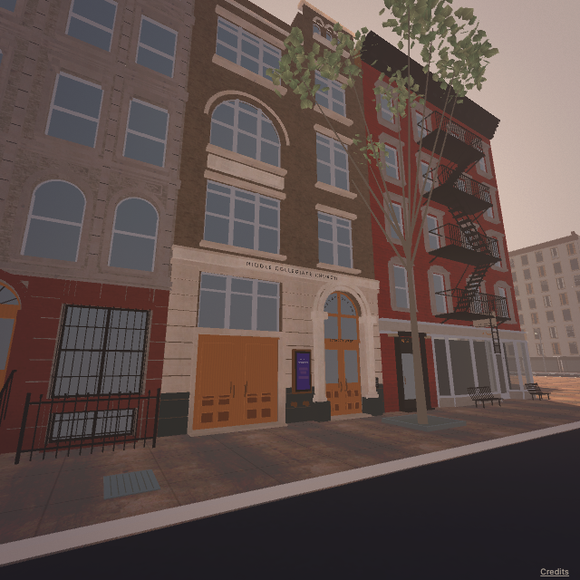

# Seventh Street revision 03 — architectural fidelity candidate

September 14, 2026. The user's Street View comparison showed that revision 02's resemblance did not meet the requested door/window/label/access precision. This pass changes the **entire existing 82-frontage Seventh inventory**, with the 50/48½ East 7th pair as the detailed comparison case. It remains a candidate reconstruction, not a certified 1:1 street or an accepted template for cheaper-model production.

Play with `npm run dev` at **http://127.0.0.1:5173/seventh/**. The current source/save/push/deployment states are in [the handoff](../CODEX-HANDOFF.md). No other street was expanded and no publishing or autonomous reconstruction job was started. Driving, audio, cameras and the return circuit are preserved.

## Architectural changes

- **76 explicit elevation schedules**, plus six preserved corner/landmark recipes, replace the Seventh face's generic grid/door choices. The schedules contain **1,547 window groups and 77 entrances** with position, width, row height, shape, sashes/mullions, hood, trim, grilles, panel/leaf layout and access. Counts describe authored geometry, not accepted matches.
- **50 East 7th:** removed the obsolete stoop; modeled the separate at-grade oak double entrances, engaged columns, layered arch, fanlight/transom, smaller lower panels, address and church inscription. Corrected the grouped windows, scroll apron, asymmetrical balustrade/tower, purple notice case and visible service fittings. The source's current entrance is corroborated by the April 2026 panorama and [June 2026 exterior photographs](https://daytoninmanhattan.blogspot.com/2026/06/the-1892-middle-church-house-50-east.html).
- **48½ East 7th:** red brick, individual window/hood treatment, black cornice/fire escape, pale solid stone window hoods and the separate residential doorway **left** of Van Leeuwen. An adjacent April 2026 viewpoint resolves the single larger glazed door with its narrow fixed left sidelight and literal **48 1/2** transom text. Corrected the brick pier/door span, continuous white fascia and brackets, projecting multi-pane shop bays, recessed shop door, projecting sign and open metal benches. Script lettering and metric projection depths remain substitutions/estimates.
- Throughout Seventh: corrected grouped/unequal bays, window profiles, individual entrance positions and access, pale stone versus brick zones, base courses, pilasters, spandrels, shell aprons and cornice/parapet profiles. Examples include 43's paired outer bays, 62's three upper bays, 102's projecting groups, 92's street-facing height and 140's residential ground windows.
- **17 provisional unlettered ground units** preserve physical openings where current tenant identity is unresolved. Their exact subdivisions/hardware are explicitly provisional; they are not evidence of completed shop fidelity. Existing separately modeled displays remain visible through transparent shop glazing. Residential glass uses a single opaque material treatment without an added reflection pass. No newly matched ramp is claimed; access includes at-grade and stoop corrections, with unobserved ramps still unresolved.

The new kit is [seventh_fidelity_kit.py](seventh_fidelity_kit.py), installed only by the separate engine exporter. The original storefront namespaces and original ten-block runtime remain intact. All five preserved First & Seventh engine GLBs retain their previous hashes. [Preservation evidence](engine-review-2026-09-14-03/preservation.json).

## Reference and quality benchmark

The [benchmark contract](SEVENTH-FIDELITY-BENCHMARK.md) requires exact visible counts/types/text, explicit access, annotated camera alignment, close and oblique review, source provenance and a performance/preservation gate. It applies to every frontage. A name/photo/source record, successful export or attractive distant view cannot satisfy it by itself.

The [82-frontage review inventory](seventh-street-coverage-03.json) retains individual sources, geometry status, unknowns and outstanding gates. **No new frontage is marked user-accepted or independently certified against all gates.** Current camera locations, dates and headings are stored in `storefront-details.json.seventhEngine.sources`. Archive capture dates remain unknown when only an upload date is available.

The [church pose diagnostic](seventh-fidelity-camera-03.json) stores ten approximate manual landmarks and a pose-only fit while retaining the raw metadata views separately. Its one-view RMS is about **9.5 pixels at 640×640**. This does not pass independent multi-view calibration or exact detail acceptance; the landmark readings are approximate. Orthographic elevations and entrance closeups are separately labeled diagnostics.

The private user screenshot stays untracked. Neither its unrelated desktop content nor Google/reference-photo pixels are distributed. All new documentation images are actual engine/browser captures. [Source notices](../THIRD-PARTY-NOTICES.md).

## Runtime verification

Results and exact package hashes are recorded in the evidence directory; the current checkpoint distinguishes final source and documentation commits. The before-optimization browser report is retained to show the detected slowdown. Carved trim was then changed from closed tubes to shallow beveled profiles, retaining visible contours while removing hidden faces.

The final [browser run](engine-review-2026-09-14-03/browser-final.json) tested the **exact included package**, with all late sidelight/bay/stone-hood corrections. It passed all 12 camera/weather combinations, steering, brake/reverse, key-driven drift/recovery, pause/reset, settings reload, actual focus loss, Retina pixel cap and postcard download. Drift reached **29.22°** and recovered to **−2.70°** after countersteer with zero contacts. Healthy runtime recorded zero errors, warnings or failed requests. Injected pack-download failures and WebGL context loss both exposed Retry and recovered; their expected errors are recorded separately.

| Driving sample (1440×1000, full render scale) | Golden | Dusk | Rain |
| --- | ---: | ---: | ---: |
| Northbound | 74.80 FPS | 75.00 FPS | 75.00 FPS |
| Seventh eastbound | 74.73 FPS | 62.84 FPS | 64.80 FPS |
| Seventh westbound | 73.50 FPS | 68.44 FPS | 67.09 FPS |

Local startup was **5.920 s**, versus revision 02's 4.95 s. The mean of the nine samples was **70.69 FPS**, about **4.6% below revision 02's 74.12 FPS**. The worst individual comparison was dusk/east, about **15.9% lower**. An [earlier candidate run](engine-review-2026-09-14-03/browser-before-bay-correction.json) measured 61.70 FPS in rain/west and a 72.72 FPS nine-sample mean. These runs show variation and localized regressions; the proposed short-sample/mean/package gate passes, but **sustained 60 FPS is not established**.

Final PCK **82.10 MiB**, full runtime **120.18 MiB uncompressed**; estimated Brotli PCK+WASM **81.82 MiB**. Final PCK SHA256: `e6279599b212cbc07753871e25af98e8246513a9059845abb677995c4aa05654`. [Package/source hashes](../dist/seventh/build.json).

The final-source [native run](engine-review-2026-09-14-03/native-final.json) passed the **nine-waypoint circuit in 66.924 s** and the complete **545 m Seventh traversal in 24.874 s**, both with zero contacts. Building collision, reverse, reset and 12 camera/weather captures passed. Native sample FPS is a separate renderer/window diagnostic and is not substituted for the browser figures above.

`npm run verify` and `npm run seventh:verify` passed on the final source/package: original road/vehicle/material/presentation invariants, 11 package files, 69 source hashes, 182 buildings, all 82 Seventh frontages and the explicit architecture bounds/part/path checks. All 182 cached GLB hashes, five preserved corner GLBs, old storefront namespaces, original runtime and unchanged vehicle/audio source were checked separately. These checks do not certify appearance. [Saved verification](engine-review-2026-09-14-03/verify-seventh.txt).

The [saved visual set](engine-review-2026-09-14-03/visual-captures.json) contains **137 actual game images**: 14 contact sheets representing all 82 native elevations, **117 final-package perspective images** (33 reference-camera starting poses, one separately labeled church pose fit and 83 entrance closeups), plus six driving/shop views. All native elevations were inspected during the full-street pass; the final 48½ correction was re-inspected. [Only that building changed](engine-review-2026-09-14-03/late-frontage-correction.json) after that inspection; all other 181 GLBs remained identical. Final pair/selected closeups were inspected. The other captured closeups are retained for continued detailed review, not automatically passed.

- [50 and 48½ comparison view](../docs/images/seventh-engine-03/fidelity/church-pose-fit.png) — an approximate one-view pose fit, not certified photographic alignment.
- [50's right entrance](../docs/images/seventh-engine-03/fidelity/entry-241829575-1.png), [48 1/2 door and fixed sidelight](../docs/images/seventh-engine-03/fidelity/entry-241829643.png), [projecting shop bays](../docs/images/seventh-engine-03/browser/shop-2494064642.png).
- [All 82 elevations](../docs/images/seventh-engine-03/elevations/) and [all final perspective captures](../docs/images/seventh-engine-03/fidelity/), with [capture metadata](engine-review-2026-09-14-03/fidelity-final.json).

Thirty-six temporary Google inspection files created during this task were removed after inspection. Source IDs, dates, poses, relevant observations and explicit exclusions remain in the schedule. No user file was removed.

The scene has **3,346,371 source triangles**, versus revision 02's 3,431,884. Trim optimization reduced the intermediate 3,776,075-triangle candidate by about 11%. Shared material maps and static batching remain; the work adds no backend or runtime dependency on imagery services.

Performance measurements use local HTTP on an Apple M1/8 GB, Chromium/Brave, 1440×1000 CSS pixels and DPR 1, with full render scale. They are short, warmed driving samples. Startup includes a local transfer with HTTP cache disabled and warmed browser/driver compilation caches. They are not public-network, broad-device or 500-user capacity tests. Initial download is still substantial.

## Remaining fidelity work

The current models are more explicit and individually authored, but **literal every-house 1:1 fidelity is not established**. Remaining work includes independent camera/plane calibration, exact measured proportions, fine carving and door hardware, precise commercial type/logo outlines, concealed thresholds/steps or ramps, current interiors and uncertain storefront subdivisions. Some source views are blocked by sheds, vehicles or trees; the preserved landmarks also require the stricter review. The moved church-side tree improves entry visibility but its trunk/crown placement is still estimated.

Continue the saved per-elevation mismatches within Seventh and review the comparison pair with the user before using it as an accepted example for cheaper models. The source/benchmark/review tools are reproducible, but an autonomous imagery acquisition/worker/acceptance pipeline has not been implemented. Wider-map fidelity and publishing remain separate future work.
