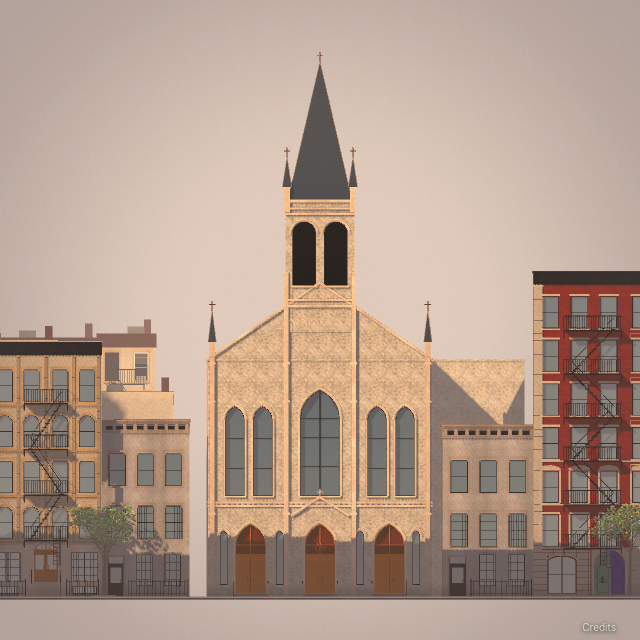
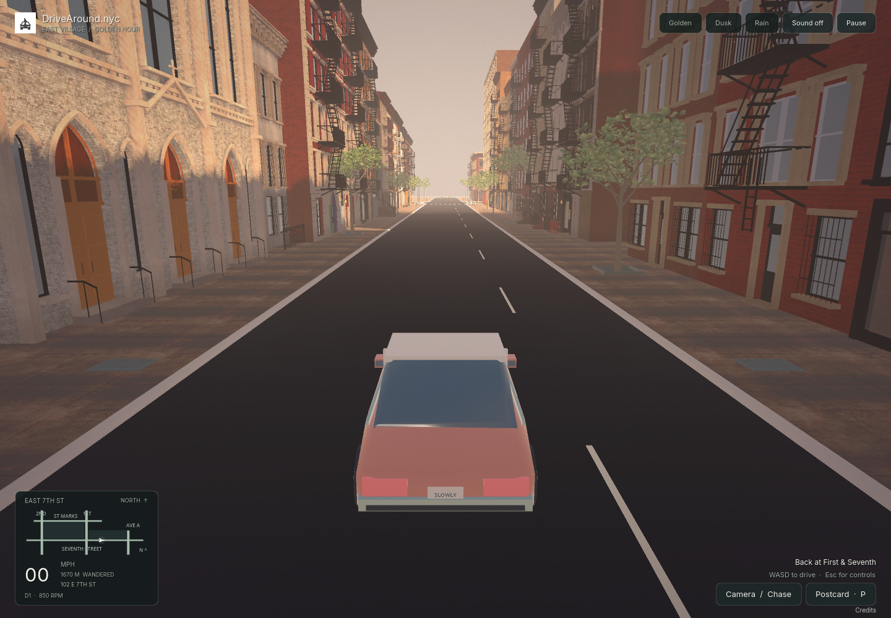

# East Seventh, First Avenue–Avenue A — revision 06

September 21, 2026 local session (evidence timestamps continue into September 22 UTC). This implements a public-reference architectural pass on both sides of the requested block, using the user-endorsed First–Second revision 04 as the visual standard. It is a locally reviewable candidate, not a claim that every minute detail or current street condition matches a photograph. The published interface, west block, accepted First Avenue corner and original game remain preserved.

## Scope and visible changes

The [inventory](east-seventh-coverage-06.json) covers **37 Seventh-facing records: 35 editable and two protected corner records**. Thirty-three building models changed; 92 and 131 retain their existing source-guided models. Both church profiles now use individual opening schedules. The full exported neighborhood remains 182 buildings and 82 Seventh frontages; no new block is added.

- **Identity and opening counts:** correct the duplicate 101 to 109, identify 116, and show the McKinley 111–115 and 117–119 ranges. Correct six bays at 117–119, four at 98, and three at 116/118/120. Preserve original mapped geography; corrections are engine-only.
- **Residential architecture:** distinguish curved lintels from actual arched glass, paired parlors from ordinary sash, at-grade entries from raised stoops, separate residential access from shop openings, and plain/parapet/corbelled cornices. Refine 95/97/97½/99, the rectories, 112/114, the south-side roof heights, 123/129 ogee openings and 128's projecting terrace. Heights, depths and step dimensions are photographic estimates.
- **McKinley:** six upper rows, nine-bay rhythm, recessed air shafts and balconies, two fire escapes, pale stone bands, asymmetric ground units and the separately placed inscription. Retain Ladybird's dated mint/lilac entry treatment.
- **St Stanislaus:** five principal pointed upper windows, four narrow lower lancets, three paired timber portals, pale brick and trim, belfry openings, piers, pinnacles and spire. Opaque pointed door heads are separate from the glazed upper windows.
- **Former St Mary:** rough stone facade, paired timber entrances and steps, six round-headed upper openings, louvered bell stage and roof. The March 2026 conversion approval is not modeled as completed construction.
- **Shops and corner faces:** add Mary O's source-linked green awning with a solid lettered valance and timber frontage; separate Trash & Vaudeville's residential access from its pink displays; retain source-guided Ho, Pylos, 787 and Ladybird details; explicitly author the Seventh-facing Yuca and Miss Lily's returns without covering their independent entries. Unknown occupants stay unlettered.
- **Address HUD:** extend the existing locator through Avenue A, keep both blocks' boundary hysteresis, and hide addresses at First/Avenue A intersections and outside the requested street.



*Actual browser capture, not a street photograph. [Church entrances](../docs/images/east-seventh-06/fidelity/frontage-248142618-perspective-1.png), [McKinley](../docs/images/east-seventh-06/fidelity/frontage-248142624-elevation.png), [former St Mary](../docs/images/east-seventh-06/fidelity/frontage-248142640-elevation.png), [Mary O's](../docs/images/east-seventh-06/fidelity/frontage-248142715-perspective-2.png), [Yuca return](../docs/images/east-seventh-06/fidelity/frontage-248142714-perspective-2.png), [Miss Lily's return](../docs/images/east-seventh-06/fidelity/frontage-248142407-perspective-1.png).*

## Source and review boundaries

The [observation ledger](east-seventh-observations-06.json) separates visible architectural facts, authored proportions and missing evidence. Public Building Blocks elevations were inspected for editable records, with supplementary architectural/LPC sources and dated exterior business photographs. Archive capture dates are generally unknown; upload years are not substituted for capture dates. Ladybird has a 2026 exterior, Trash a 2025 exterior, Mary O's a 2024 exterior, and Ho/Pylos/787 have older 2021 exterior evidence. Current official business pages support identity only when their photographs show products/interiors. The Miss Lily's oblique return view is dated December 2024. Source links and attribution remain in the ledger and schedule; no downloaded source pixels enter the export or review screenshots.

The user authorized up to 40 Street View reference images. Twelve metadata lookups returned `REQUEST_DENIED` because Google Cloud billing was disabled. **Zero image requests were made.** The user then instructed: **“Finish using the public references for now.”** No retry is scheduled and no account/key setting was changed.

All **37 final whole elevations and 52 overlapping ground perspective views** were captured and visually inspected, following a baseline and earlier correction iterations. Four additional authored oblique views check church depth and shaded stair geometry; worn edge tones remain material estimates. The [capture manifest](east-seventh-review-06/fidelity.json) stores poses, hashes and exact package identity; the [visual review](east-seventh-review-06/visual-review.json) covers every assigned frontage. The 89 final game images are retained in [docs/images/east-seventh-06/fidelity](../docs/images/east-seventh-06/fidelity/). Orthographic views expose the complete facade rhythm; ground perspectives expose entry/shop separation. These diagnostic cameras are **not calibrated photographic matches**. There are zero calibrated multi-view passes; successful exports and counts do not change that.

Remaining fidelity work is explicit:

1. **108 site:** the archive shows a low garage wall; a 2015 garden/fence approval does not establish its built/current condition. The existing mapped gap remains, pending a newer observed reference.
2. **Street fixtures and temporary conditions:** existing tree, lamp, hydrant and curb-furniture placement is retained. Facade-local stoops/rails were corrected, but current per-object street positions, scaffolding, temporary seating and construction are not fully source-accepted.
3. **Occluded or older ground details:** current tenants, threshold geometry and small lettering cannot all be established. The complete current upper elevation of 131 was not re-established; its prior model is retained.
4. **Precision:** carving, exact materials, widths/heights, hardware, hidden returns/roofs and camera calibration remain estimates. Additional evidence and matched review are required before claiming the entire block meets photographic 1:1 criteria.

## Runtime and preservation

The visual and full behavior review used PCK `c29296a391a7700ec33a3c68183203a0db92622abd47375f3cc48300167b3cc9`. A final [metadata refresh](east-seventh-review-06/metadata-refresh.json) corrects the explanatory schedule counts and cached review-height export. It verifies identical model/render/collision records and runtime code, with only source/input signatures changing. Final performance, address smoke and package checks identify the final PCK independently. [Full/partial export equivalence](east-seventh-review-06/partial-rebuild.json) verifies the rebuild fix.

Final validation and package figures are indexed in [validation.json](east-seventh-review-06/validation.json). The [preservation check](east-seventh-review-06/preservation.json) confirms all **147 out-of-scope/protected building hashes** are unchanged, along with the original game, geographic source, accepted corner source, UI/camera/car source and audio. Another two editable models are retained, giving **149 unchanged / 33 changed** building models. Only the `seventhEngine` namespace changes semantically in the shared storefront schedule.

The package and 84 source hashes pass `npm run seventh:verify`; the original `npm run verify` also passes. Native address, handling and four-camera tests pass. Browser and performance results, including any initial failures/repeats, are recorded in the validation index rather than inferred from structural checks. The package remains a static local-browser export; no remote GPU or imagery service is required to play.

## Measured final results

- Final PCK: `600c609cfb9bb17267e0668bcf9729c46ef0db2fd4f442758461688c0aa56432`, **88,153,136 bytes**; 14 runtime files total **128,522,854 bytes**. PCK growth from the session baseline is approximately 0.87%.
- Both verification commands pass. All 17 browser address cases pass on the final package. Four-camera inspection, six full-block routes in three weather states, driving/braking/drift, pause/settings/Retina, postcard download, missing-pack retry and graphics-context recovery passed on identical geometry/runtime code. The initial fixed-delay focus assertion and the successful corrected repeat are retained separately.
- On Apple M1 / 8 GiB, Brave Chromium 153, 1440×1000 / DPR 1, the nine comparable final samples average between **59.75 and 60.03 FPS**, with final render scale **1** in every sample. Baseline range: **59.00–60.04 FPS**. Local ready time: **5.873 → 5.579 seconds**. These are short local samples with a roughly 60 FPS ceiling, not a speedup, sustained frame-rate or 500-user claim. [Conditions and per-route comparison](east-seventh-review-06/performance-comparison.json).
- Building triangles: **3,362,194 → 3,401,466** (+1.17%). All 147 protected/out-of-scope models and both private inputs remain unchanged; private screenshots remain untracked.



*Actual reviewed game package. [Looking west](../docs/images/east-seventh-06/browser/east-block-0-west.png), [dusk](../docs/images/east-seventh-06/browser/east-block-1-east.png), [rain](../docs/images/east-seventh-06/browser/east-block-2-west.png). These show the authored presentation, not proof of photographic equivalence.*

## Reproduce and continue

```sh
npm run dev
# Play http://127.0.0.1:5173/ and drive east along Seventh toward Avenue A.
# /seventh/ is the same export; /index.html remains the original game.

# Rebuild geometry only when its source changed or the ignored cache is absent:
blender -b -t 4 --python-exit-code 1 --python model-source/export_seventh_engine.py
npm run seventh:build
npm run seventh:verify
npm run verify

# With the isolated CDP browser on 9222:
node scripts/review-seventh-fidelity.mjs renders/east-seventh-review '' model-source/east-seventh-reference-06.json
node scripts/review-seventh-address.mjs renders/east-seventh-address
node scripts/review-seventh-camera.mjs renders/east-seventh-camera
```

Source geometry lives in `storefront-details.json.seventhEngine`, `seventh_street_kit.py` and `seventh_fidelity_kit.py`. The new shapes, church profiles, solid awning valance and corner-return units are opt-in; unchanged building hashes verify that their defaults preserve existing output. A partial-rebuild metadata check also caught cached review-camera heights reverting to older source values. The exporter now derives those heights from the actual exported model records, and verification checks that invariant; building geometry is unaffected. The model cache under `engine/first-seventh/assets/neighborhood/` is ignored; the tracked browser PCK and source recipes are the durable deliverable. Do not delete `dist/`, introduce `dist/index.html`, or run the legacy compiler to apply engine-only corrections.

Use the [reconstruction skill](skills/reconstruct-street/SKILL.md) for further work. Before another correction, read the current scope/review record and confirm the actual geometric face, neighboring addresses, source date and effective schedule. Retain the existing package for comparison. Resume from user review or a specific unresolved evidence item; do not silently certify all 37 records, expand to another block, change music/UI, or publish. Git save/push/deployment status is in the [current handoff](../CODEX-HANDOFF.md); `build.json.sourceCommit` remains the inherited geographic baseline, not the Git commit of this pass.
