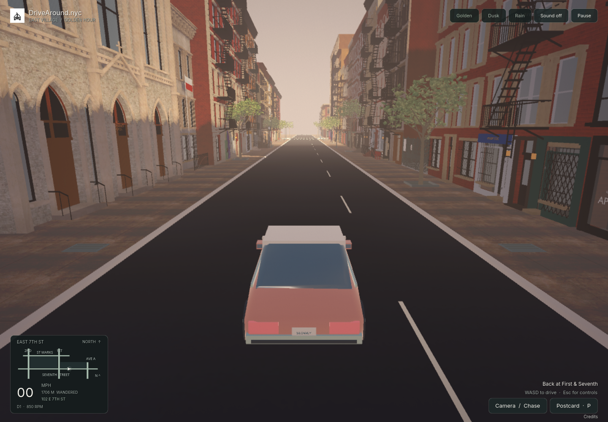
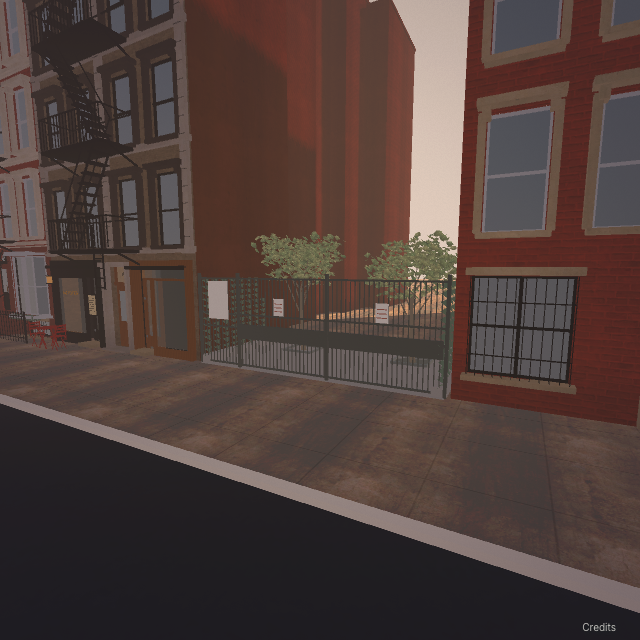
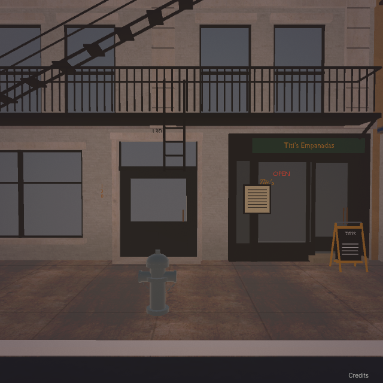

# East Seventh revision 07 — browser reference refinement

September 23, 2026. **Implemented, reviewed, user-endorsed and published September 23.** Scope is both sides of East 7th Street from First Avenue to Avenue A: 35 editable frontage records, two protected First Avenue corner records and the 108 street edge. The user explicitly requested ordinary browser Street View observation and address numbers in their observed positions. The user subsequently requested publication to main/production and endorsed browser Street View inspection as the preferred reference method. Release `4b999cd` passed both CI jobs and Vercel production; live routes and the full PCK match the reviewed files. [Publication evidence](east-seventh-review-07/publication.json) and the current handoff record exact checks.

## Evidence and changes

Every one of the 37 frontage records has an actually inspected browser view. The [observation ledger](east-seventh-browser-07.json) contains source URLs, April 2026 capture dates, close/overlapping views, observations and occlusions. This is an April snapshot, not proof of September conditions. No paid Street View image request, billing change or reference-image texture was used. Source pixels are temporary working previews and are not distributed with the game.

The implementation updates individual doors, entries, number positions, shop divisions, window rhythms and dated construction, with a separate observed schedule for each facade. Examples:

- Two numbered 93 entrances and the separate 93½ Mary O’s awning; dark single-leaf entries at 97 and 99; 97’s small light door plate and solid terracotta arch infill.
- The rectory’s gabled 101 board and bronze silhouette; three grilled ground windows at 109; St Stanislaus door crosses and dark pointed transoms.
- McKinley’s gold **111** fanlight number, broad operable leaf and fixed sidelight; the raised 117 entrance; the green 121 sidewalk shed.
- Center entrances and observed businesses at 123/125/127/131; separate left and right 129 entries and their number placements.
- White 94 rails, the brick-pier/lattice stoop at 98, red gridded doors with **100** on the left leaf, APT 2F’s **102 E 7TH ST** window lettering, and the distinct 104 shop fronts.
- White projecting parlor oriels at 112; full-height arched wooden double doors with **114** on the meeting stile; corrected four-bay elevations and ground uses at 116/118/120.
- The Jones Street Wine Bar bays, Giano fascia and gold 126 header, blue scaffold/netting and the **128 EAST 7TH ST** shed board.
- Yuca’s five uneven window stacks and blank eastern strip; the cream paired-window Avenue A corner return, Miss Lily’s pink/blue front, separate **130** portal and green Titi’s storefront.
- The observed iron gates, paving, ivy and small trees at 108. Hidden rear-building dimensions were not invented.

Sizes, substitute lettering, weathering, relief depth and concealed hardware remain authored estimates. The original map, west block, accepted corner, compact interface and audio remain protected. The original shared storefront recipe stays byte-identical; new components are confined to the Seventh engine adapter.

## Render review and verification

The first candidate produced 37 full elevations and 52 overlapping ground views, all inspected. Review caught missing parlor rows at 116/120 and incorrect corner rhythm/entrance ownership. [Repair decisions](east-seventh-review-07/repair-decisions.json) retain these findings and their corrections. All 37 final elevations, 52 overlapping ground views and nine obliques have now been recaptured and inspected. The [per-property review](east-seventh-review-07/visual-review.json) links every saved game image; [capture metadata](east-seventh-review-07/fidelity.json) records the actual package and camera poses. These views are diagnostics, not calibrated photographic overlays.

All 35 editable building models changed. All 147 protected/out-of-scope models are byte-identical to the baseline; the [preservation records](east-seventh-review-07/preservation.json) also verify original-game files, shared storefront recipes and both private screenshots. Building triangles grew from **3,401,466 to 3,466,757** (+1.92%).

The final PCK is **89,466,244 bytes**, SHA256 `746113ee606ebfb6b6b0e32861974ce2ae3445c25d7a6b509b011c7c6bd393fa`; the 14 runtime files total **129,835,962 bytes**, with 86 matching source hashes. Godot 4.7.2. The manifest’s `sourceCommit` is an inherited geographic baseline; see the handoff for the actual Git save. Original-game and Seventh package/architecture checks pass; native address, handling and four-mode camera checks pass. The full browser suite, 17 address cases and four camera inspection modes passed on the initial refined package. A final static batching correction at 108 preserves all model assets and the gate collider; all final captures, performance samples, driving and focused recovery checks are complete. Six final-package routes traverse the full block in both directions across all three weather states without contacts. The first final-package settings reload hit the loader watchdog while the visible browser was OS-unfocused; the focused repeat passed settings, Retina resizing, tab-switch pause, postcards and download/graphics recovery with zero unexpected errors or failed requests. That failure is retained, and the runtime loading code is unchanged. The [validation index](east-seventh-review-07/validation.json) and [test boundaries](east-seventh-review-07/batching-boundary.json) distinguish the exact packages and attempts.

A local performance comparison covers nine routes/weather samples on Apple M1 / 8 GiB, Brave Chromium 153, 1440×1000 / DPR 1. Baseline **40.13–53.93 FPS**, final **37.68–55.54 FPS**; sample means **46.17 → 46.64 FPS**. Final adaptive scales range from 0.75 to 1. Local ready time **8.833 → 8.965 s**. This does **not** demonstrate the 60 FPS project target or a statistically established speedup. The first refinement had excess draw calls because nested 108 meshes bypassed the existing batcher; sharing those static meshes reduced westbound sample averages from **813–818 to 621–626 draw calls** without deleting detail. [Measurements and limits](east-seventh-review-07/performance-comparison.json).

Reproduce locally with the included player: `npm run dev`, then open **http://127.0.0.1:5173/**. The [engine README](../engine/first-seventh/README.md) contains the Blender/Godot rebuild commands. `/index.html` remains the original game, and `dist/index.html` must remain absent.

## Remaining limits

Unreadable or obstructed numerals, tiny plaques, exact ornament profiles, curved ironwork and concealed surfaces remain unresolved. A visible address is not permission to stamp that number onto an unsupported door location. Complete curb-tree/lamp/hydrant/furniture placement remains the prior estimated treatment outside the newly observed 108 edge and facade-local sheds. The rear of 108 is not reconstructed by the gate/planting work. Broad Avenue A facade coordinates and depth still need calibrated comparison.

There are **zero calibrated multi-view acceptance passes**. Source inspection, readable numbers, structural verification and a successful export do not establish photographic 1:1 or surveyed accuracy. Revision 04 remains the user-endorsed visual direction; revision 07 is the user-endorsed east-block refinement. This endorsement does not certify the stricter photographic benchmark. Read the [current handoff](../CODEX-HANDOFF.md) for exact Git, test and publication states.
