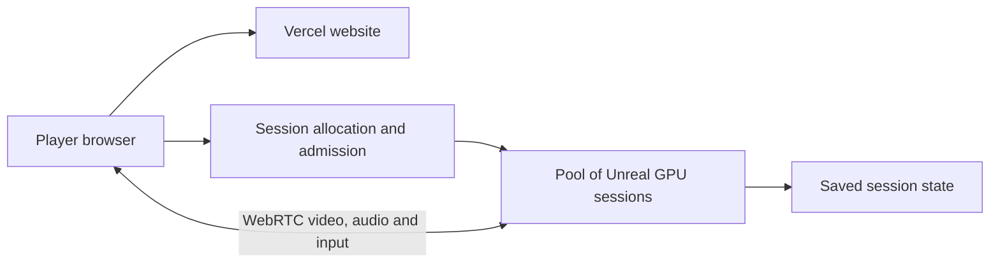

# First & 7th Unreal browser pilot — September 14, 2026

**Superseded compute decision:** Later September 14 the user said a GPU machine is unavailable and authorized proceeding with available tools. The [Godot browser slice](../engine/first-seventh/README.md) is now implemented locally. Its [review](SEVENTH-ENGINE-01.md) and [current handoff](../CODEX-HANDOFF.md) take precedence. The plan below remains a historical future Unreal option; its pending-question and Godot-pause statements are no longer current instructions. No GPU hosting was purchased.

The user wants a proper browser driving game with an aesthetic lofi animated look, changing weather, proper streets and several driving viewpoints, with GTA Vice City as a gameplay reference. The immediate scope is First & 7th; the eventual capacity target is approximately 500 independently controlled simultaneous players. This supersedes the previous browser-engine recommendation. New Godot implementation is paused after this clarification. No Unreal project has been built or streamed yet.

## First playable milestone

Use the existing five corner buildings, nine elevations and eight shop treatments as the foreground reference, retaining all photographic provenance and unmeasured-detail disclosures. The pilot can reuse the surrounding existing geometry to allow a circuit of First Avenue, East 7th, Second Avenue and St. Marks Place. This is a small reuse/export area, not a new whole-map fidelity pass.

Art direction: warm painted materials, coherent peach/lavender dusk, soft atmospheric depth, clear silhouettes, a distinctive stylized car, readable shop lighting and wet asphalt during rain. Establish full-corner and close-up comparison views before accepting materials. GTA is a reference for driving freedom and cameras; do not copy its assets, map, branding or music. Preserve authored facade detail rather than equating simplified materials with permission to remove windows, signs or fire escapes. Virality cannot be guaranteed.

The actual deliverable should include chase, hood, cockpit and overhead cameras; predictable steering, braking and reverse; camera collision; a compact HUD; golden-hour/dusk/rain transitions; pause/reset; and a working browser stream with reconnect. A blueprint, an exported model or an untested source scaffold does not satisfy this deliverable.

## Delivery architecture

Unreal Pixel Streaming renders the game on a host GPU and streams video/audio to a browser while receiving its input. It is not a WebAssembly export of the Unreal runtime. [Epic overview](https://dev.epicgames.com/documentation/unreal-engine/overview-of-pixel-streaming-in-unreal-engine).

Vercel can continue serving the public site and player interface. GPU hosts run the packaged Unreal application; signaling and STUN/TURN handle connection establishment and relay when required. Video does not pass through a Vercel Function. [Vercel CDN](https://vercel.com/docs/caching/cdn-cache), [Epic networking guide](https://dev.epicgames.com/documentation/unreal-engine/hosting-and-networking-guide-for-pixel-streaming-in-unreal-engine).

Plan for independent sessions initially. A shared multiplayer city is a separate game-networking feature and has not been implemented or silently included. A shared video stream/SFU gives many viewers the same rendered session; it does not supply 500 independent cars and cameras. Multiple Unreal processes may share a GPU if measurements support it; do not assume one GPU per person or assume a specific packing density.

## Compute decision needed

The local development machine is an Apple M1 MacBook Air, 8 GB RAM, with approximately 28 GiB free disk at session start. Unreal is not installed. Epic currently lists 16 GB minimum and 32 GB recommended memory for macOS. This machine is not a suitable basis for promising a smooth Unreal editor and cloud-scale performance. [Epic Mac requirements](https://dev.epicgames.com/documentation/en-us/unreal-engine/macos-development-requirements-for-unreal-engine).

A sensible pilot candidate is one Windows GPU workstation with at least 8 vCPUs, 32 GB system RAM, an NVIDIA L4/A10-class GPU, and around 250 GB persistent storage for the OS, engine, project and build cache. This is a proposed specification, not a provisioned machine or verified benchmark. Prefer a region near the first testers. AWS G6 explicitly supports graphics, game streaming and hardware video encoding; its quotas and actual regional capacity need checking before an order. A generic CPU droplet is insufficient. [AWS G6](https://aws.amazon.com/ec2/instance-types/g6/), [AWS quotas](https://docs.aws.amazon.com/ec2/latest/instancetypes/ec2-instance-quotas.html).

The user has been asked whether an existing GPU machine is available or whether to prepare a small paid cloud pilot. This is still pending. No account, purchase, VM, subscription, upload or public deployment has been created. Existing Epic/account agreements and remote access must be handled on the user's machine; never record credentials here. Do not start billing based on an assumed answer.

## Dated cost reference

Checked September 14: Vagon Streams lists Pro G3 (L4, 8 cores, 32 GB RAM) at $0.047/minute, or $2.82/hour. Its page also lists $0.67/day application maintenance; region, quality and plan choices can change charges. This is streaming usage, not a quote for an Unreal development workstation. A trial is advertised, but eligibility and allowances are unverified. [Official pricing](https://vagon.io/streams/pricing).

At that illustrative rate, 500 sessions lasting 30 minutes use 250 session-hours, or $705 before other charges. Five hundred continuously active sessions use $1,410/hour. A negotiated deployment or measured multi-session GPU hosting can have different economics. Do not describe a free plan or trial as sustainable capacity for 500 simultaneous games.

For self-hosting, estimate GPU hosts as `ceil(active sessions / measured safe sessions per host)`, then add measured headroom and a spare-host allowance. Include standby capacity, CPU/RAM, persistent storage, video egress, TURN relay, signaling, telemetry and operations. There is no defensible end-to-end price before the slice is profiled.

At an assumed 8 Mbps video rate, 500 streams need about 4 Gbps aggregate video delivery, or 1.8 TB/hour, before audio/protocol/relay overhead. This is arithmetic, not a recommended final bitrate or a measured workload.

## Validation and growth

1. Build, cook and run one First & 7th session on the selected GPU. Review full elevations, shop details, the car and all cameras in each weather state. Initial target: 1080p60, with a tested 720p fallback; these are targets, not observed results.
2. Profile GPU/CPU frame times, memory, video encoding, bitrate, first-frame time and end-to-end input latency. A proposed near-region p95 input-to-display target is under 150 ms. Rendering at 60 FPS alone does not establish responsive streaming.
3. Test several independent processes on the same host. Measure sustained driving in rain and the densest view, including startup overlap, rather than extrapolating from a stationary camera. Record the safe sessions per host at the accepted quality.
4. Exercise disconnect/reconnect, browser reload, lost focus, a crashed Unreal process, a failed host and deployment rollback. Release abandoned sessions. A replacement process restores periodically saved position, camera and weather; do not promise seamless failover without implementing and testing it.
5. Increase load through 5, 20, 100 and eventually 500 independently controlled sessions. Reserve GPU quota/capacity, isolate inputs, use short-lived session allocation, bounded retries, admission queues and spend limits. Maintain warm capacity for startup latency; never launch unlimited paid sessions from an unauthenticated click.
6. Introduce redundant signaling/allocation, spare render capacity, multiple availability zones/regions and compatible versioned saves as measured demand requires. Route new sessions away from failures and deploy new builds to a separate pool before draining old sessions. Autoscaling, redundancy and these tests are all unimplemented.

## Work already saved and its limits

- Original gameplay/source remains `c76dccebc143960498d21eeab8c55c2d0dbcc5ce`. The published browser game has not been changed by this engine investigation.
- [Fresh browser baseline](engine-review-2026-09-14/browser-baseline.json): local HTTP, Brave/Chromium on Apple M1, 1440×1000, DPR 1, HTTP cache disabled. Detailed driving 22.29 FPS; warm Automatic driving 42.18 FPS, ending at ratio 0.70 with ambient shading off. It submitted approximately 6.06 million triangles and 1,187 draw calls per Automatic driving frame across all passes. The source-identical game remains GPU/CPU rendering limited even locally. These short route samples are not Unreal results or a hosting load test.
- `export_seventh_engine.py` prepared 154 existing building objects within a bounded surrounding area, 2,835,181 triangles, using independent vertex-color material experiments. Original browser models and manifests remain intact. The first sandboxed Blender launch crashed during graphics initialization; the authorized graphics-capable retry exported successfully. These outputs have not been imported into Unreal, visually accepted or validated as a complete runtime. Five-building foreground acceptance remains separate from the wider experimental material treatment.
- The initial Godot tools and incomplete shader/mesh experiments are paused and identified in `engine/first-seventh/README.md`. They are not the requested Unreal deliverable. The engine export script and existing source records preserve how to reproduce the experimental assets; the local generated cache is not required to play the current game.

Next: resolve the GPU development/streaming route with the user, obtain the exact pilot quote and spending/time limit for approval, then build and test the first Unreal browser session. Do not resume the abandoned Godot implementation or claim this plan is a completed game.
